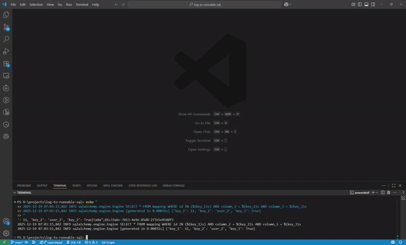

# Log to Runnable SQL (SQLAlchemy)

**Easily convert SQLAlchemy logs into executable, formatted, and highlighted SQL.**

This extension helps developers who work with SQLAlchemy or other Python ORMs to quickly turn logs containing parameter placeholders (like `%(id)s`) into standard SQL queries that can be run directly in any database client.

## 🎬 Demo



## 🚀 Features

- **Instant Parameter Injection**: Automatically replaces `%(key)s` with values from the provided dictionary.
- **Smart Parsing**: Supports 3 different SQLAlchemy log formats.
- **Prettified Output**: Automatically formats SQL using `sql-formatter` with a clean layout.
- **Syntax Highlighting**: Beautiful offline syntax coloring (VS 2015 Dark theme).
- **One-Click Copy**: Quickly copy the result to your clipboard.
- **Privacy Focused**: All processing happens locally within your VS Code.

## 📋 Supported Formats

- **Standard Engine Logs**:
  ```
  YYYY-MM-DD HH:mm:ss INFO sqlalchemy.engine.Engine SELECT col_x FROM table_y WHERE col_z IN (%(keys_1)s)
  YYYY-MM-DD HH:mm:ss INFO sqlalchemy.engine.Engine [generated in 0.00031s] {'keys_1': 'USER1'}
  ```
- **Statement/Parameters Logs**:
  ```
  statement: SELECT col_x FROM table_y WHERE col_z IN (%(keys_1)s)
  parameters:
  {'keys_1': 'USER1'}
  ```
- **Bracketed SQL**:
  ```
  [SQL: SELECT col_x FROM table_y WHERE col_z IN (%(keys_1)s)]
  [parameters: {'keys_1': 'USER1'}]
  ```

## 🛠 Usage

1. Click **$(replace) SQL Fill** in the Status Bar.
2. Paste your raw log into the left editor.
3. The result appears on the right instantly.
4. Click **Copy Result**.

## 📦 Requirements

- VS Code 1.103.0+

---

**GitHub Repository**: https://github.com/moow8393/log-to-runnable-sql

**Happy Debugging!**
